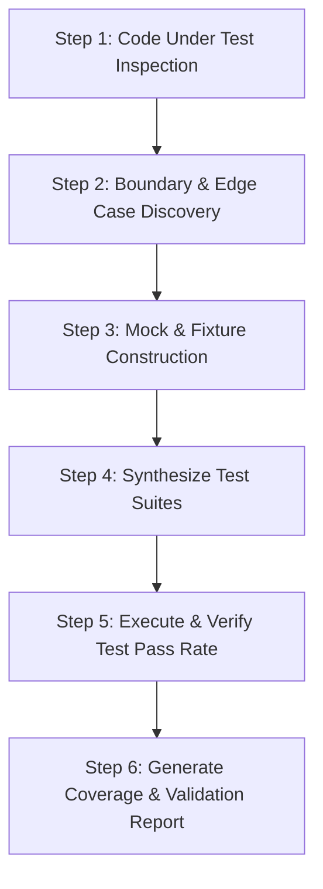

# Automated Testing & Validation Hub

The **Automated Testing & Validation Hub** skill transforms test authoring from a tedious chore into an automated, high-velocity quality engine using IBM Bob 2.0.

## When to Use This Skill

Activate this skill when:
- Adding unit or integration tests for untested or newly written code: *"Generate unit tests for this service with edge cases."*
- Identifying test coverage blindspots in modified files.
- Generating mocks, fixtures, and synthetic test datasets for complex APIs.
- Running parallel subagents to generate and execute test suites concurrently.

---

## IBM Bob IDE Feature Alignment

- **Preferred Mode**: **Code Mode** (for test synthesis) & **Agent Mode** (for running and validating tests)
- **Bob Features**:
  - **Literate Coding**: Annotate untested functions with `// test: handles null payload and timeouts` for inline generation.
  - **Subagents**: Spawn dedicated testing subagents to construct mock factories in parallel.
  - **Rollback**: Safely revert breaking test changes without corrupting working code.
- **watsonx Integration**:
  - *watsonx.ai*: Uses Granite models to analyze test run outputs, parse stack traces, and isolate flaky assertions.
  - *watsonx Orchestrate*: Coordinates end-to-end regression pipelines across distributed test runners.

---

## Step-by-Step Testing & Validation Workflow

### Step 1: Inspect Code Under Test
- Analyze target functions, parameters, return types, exceptions thrown, and side effects.
- Identify dependencies that require mocking (network, database, file system, timer).

### Step 2: Boundary & Edge-Case Discovery
- **Happy Paths**: Standard expected inputs and outputs.
- **Null / Undefined / Empty Boundaries**: Missing headers, empty strings, zero integers.
- **Error / Fault Injection**: Network timeouts, 500 errors, database connection drops.
- **Security / Malformed Inputs**: Oversized payloads, malicious SQL fragments, expired tokens.

### Step 3: Mock & Synthetic Fixture Construction
- Adhere strictly to the hackathon dataset guidelines: use synthetic test data only (no client data, no PII).
- Create reusable factories for complex domain entities.

### Step 4: Synthesize Test Code
- Follow the framework conventions used in the project (Jest, Vitest, PyTest, JUnit, Go testing).
- Maintain AAA pattern (Arrange, Act, Assert).

### Step 5: Execute & Validate Pass Rate
- Run the generated test suite: verify that assertions pass cleanly.
- If a test fails, analyze the failure stack trace and iteratively refine either the test or the target code.

### Step 6: Generate Testing Plan & Coverage Report
- Format using the [Test Plan & Validation Template](./references/test_plan_template.md).
