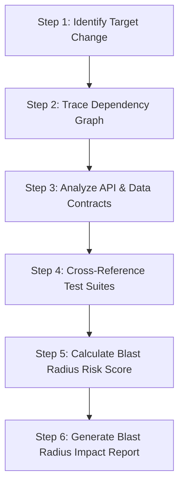

# Change Blast Radius Analyzer

The **Change Blast Radius Analyzer** skill equips IBM Bob 2.0 with a structured methodology to inspect code modifications, trace cross-module dependencies, identify impacted subsystems, verify test coverage, and assess architectural risk before changes are merged or deployed.

## When to Use This Skill

Activate this skill when:
- A developer asks: *"What parts of the codebase will break if I modify this function/file?"*
- Planning a refactoring or interface change across shared modules or services.
- Reviewing a pull request or inspecting an active `git diff` for ripple effects.
- Determining which test suites (unit, integration, regression) must be executed for a given change.
- Evaluating changes to API contracts, data serialization models, or database schemas.

---

## Step-by-Step Execution Workflow

### Step 1: Identify the Target Change Scope

1. **Inspect Target Selection**:
   - If analyzing working tree changes: inspect `git status` and `git diff` (staged and unstaged).
   - If analyzing a specific symbol or function: extract the symbol declaration, enclosing file, signature, and exports.
   - If analyzing a branch or commit range: run `git diff <base-branch>...<head-branch> --stat` and examine the modified hunks.
2. **Catalog Changed Elements**:
   - List modified files, exported functions, public classes, interface types, and environment/config parameters.

### Step 2: Trace Upstream & Downstream Dependencies

1. **Downstream Trace (Callees & Imports)**:
   - Identify libraries, utility functions, ORM models, or external services that the target code consumes.
2. **Upstream Trace (Callers & Importers)**:
   - Search codebase for all import/require statements referencing the modified file or module.
   - Search for symbol invocations, interface implementations, event listener subscriptions, and dynamic lookups.
   - For deeply nested dependencies, trace transitive callers (who calls the callers?) up to 2–3 degrees of separation.

### Step 3: Check API & Persistence Contracts

1. **Public APIs & Network Contracts**:
   - Check if changes alter route definitions, request/response DTOs, GraphQL schemas, gRPC protobufs, or webhook payloads.
2. **Database & Persistence Impact**:
   - Check if database migration scripts, ORM entities, column definitions, or caching keys/TTL are modified.
   - Flag breaking schema migrations (e.g., column drop, rename, non-nullable additions without default values).

### Step 4: Cross-Reference Test Coverage

1. **Locate Associated Tests**:
   - Find direct unit tests (e.g., `*.test.*`, `*.spec.*`, `tests/`) matching the target component.
   - Identify integration/e2e test suites that invoke the modified flow or call routes touching the changed symbol.
2. **Assess Test Blindspots**:
   - Highlight any dependent components or edge cases that lack automated test assertions.

### Step 5: Calculate Blast Radius Risk Score

Evaluate the modification against the following risk matrix:

| Factor | Critical (High Risk) | Moderate (Medium Risk) | Contained (Low Risk) |
| :--- | :--- | :--- | :--- |
| **API Boundary** | Public external REST/GraphQL API | Internal microservice API | Purely internal private helper |
| **Data Persistence** | DB schema migration / destructive change | DB query adjustment / index change | In-memory temporary state |
| **Dependency Centrality** | Root utility or core auth / billing module | Feature module shared by 2–3 views | Leaf component / isolated UI element |
| **Test Coverage** | No automated tests cover the callers | Partial coverage / unit tests only | High unit + integration coverage |

Assign an overall Risk Rating: **CRITICAL**, **HIGH**, **MEDIUM**, or **LOW**.

### Step 6: Generate the Blast Radius Report

Synthesize the findings into a clear, structured report following the [Blast Radius Report Template](./references/report_template.md).

The report must contain:
1. **Executive Summary**: Overview of changes and calculated Risk Level.
2. **Dependency & Blast Radius Map**: Mermaid diagram visualizing the blast radius.
3. **Impacted Components Matrix**: Table listing affected files, dependent symbols, and impact type.
4. **Data & Contract Hazards**: Highlighting schema changes, breaking API contracts, or state mutations.
5. **Recommended Validation Plan**: Targeted commands to run, specific test files to execute, and manual regression checks.
6. **Mitigation & Rollback Advice**: Feature flag recommendations, staging validation notes, and rollback safety checklist.
