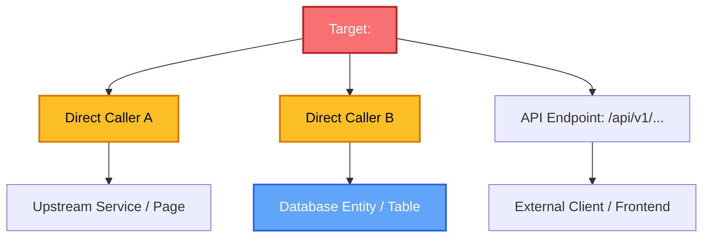

# Change Blast Radius Analysis Report

## 1. Executive Summary

| Parameter | Value |
| :--- | :--- |
| **Analyzed Target** | `<file_path>#<symbol_name>` / `<git diff / PR>` |
| **Calculated Risk Level** | `CRITICAL` / `HIGH` / `MEDIUM` / `LOW` |
| **Total Impacted Files** | `<count>` files |
| **Direct Callers Found** | `<count>` references |
| **Transitive Callers** | `<count>` upstream components |
| **Test Suites Affected** | `<count>` test files |

---

## 2. Blast Radius Visual Map

---

## 3. Impact Matrix

| Subsystem / File | Impact Type | Depth | Risk Level | Notes / Affected Functionality |
| :--- | :--- | :--- | :--- | :--- |
| `src/services/order.ts` | Direct Caller | Direct | High | Invokes changed signature; requires argument update |
| `src/routes/api/checkout.ts` | API Route | Transitive | High | Serializes modified payload to external clients |
| `src/models/user.ts` | Data Schema | Direct | Critical | Field type altered; migration required |
| `src/components/Checkout.tsx`| UI View | Transitive | Medium | Consumes updated API response schema |

---

## 4. API & Data Contract Risks

> [!WARNING]
> Document any breaking contract or database migration risks here.

- **Breaking Changes**: List any removed parameters, altered response formats, or renamed routes.
- **Database Migrations**: Note required schema alters, indexing changes, or data backfill operations.
- **Cache Invalidation**: Note Redis/Memcached keys that may become invalid.

---

## 5. Recommended Test & Validation Plan

### Targeted Automated Tests
- Run unit test suite: `npm test -- tests/services/order.test.ts`
- Run integration test suite: `npm test -- tests/integration/checkout.test.ts`

### Manual Regression Checklist
- [ ] Verify checkout flow with guest user
- [ ] Verify checkout flow with authenticated user
- [ ] Test backward compatibility with legacy API clients

---

## 6. Mitigation & Rollback Plan

- **Feature Flag Recommendation**: Protect change behind flag `enable_new_feature_x`
- **Rollback Complexity**: Fast (code-only revert) / Complex (database rollback required)
- **Deployment Strategy**: Blue/Green or Canary recommended if Risk Level >= HIGH
