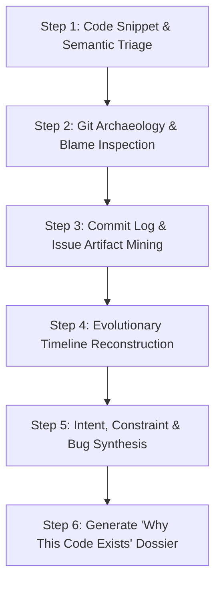

# Code Decision Detective — “Why Does This Code Exist?”

The **Code Decision Detective** skill guides IBM Bob 2.0 to act as a software archeologist and technical detective. It demystifies confusing, counter-intuitive, or legacy code snippets by excavating the rationale, historical constraints, bug fixes, and architectural trade-offs that produced them.

## When to Use This Skill

Activate this skill when:
- A developer highlights a confusing block of code and asks: *"Why is this written this way?"* or *"Can I delete or refactor this code safely?"*
- Encountering weird workarounds, edge-case guards, custom regexes, unexplained timeouts, or monkey-patches.
- Onboarding onto a legacy codebase or unfamiliar microservice with minimal inline documentation.
- Conducting code reviews where an existing piece of code is proposed to be replaced or deleted, and you need to verify it doesn't break a hidden historical invariant.

---

## Step-by-Step Investigation Workflow

### Step 1: Code Snippet & Semantic Triage

1. **Extract Target Code**:
   - Isolate the specific function, class, or block of lines under investigation.
   - Analyze its local inputs, outputs, side effects, and error handling.
2. **Identify The "Smell" or Mystery**:
   - Determine what makes the code confusing: Is it a hacky condition? An unusual retry loop? A hardcoded constant? A redundant-looking check?

### Step 2: Git Archaeology & Line Blame

1. **Run Targeted Blame**:
   - Inspect the commit authorship and date using:
     `git blame -L <start_line>,<end_line> <file_path>`
   - For deeper ancestry (if a line was previously touched by formatters or mass renames):
     `git log -S "<target_code_string>" -p <file_path>`
     `git log -L <start_line>,<end_line>:<file_path>`
2. **Trace Original Introduction**:
   - Find the exact commit that introduced the logic rather than a commit that just changed whitespace or variable names.

### Step 3: Commit Log & Artifact Mining

1. **Analyze Commit Metadata**:
   - Read the full commit message: `git show --stat <commit_hash>`
   - Look for references to issue trackers (e.g., `#1234`, `JIRA-567`, `gh-890`), pull request numbers, or bug incident descriptions.
2. **Scan Related Repository Documentation**:
   - Search the repository for related ADRs (Architecture Decision Records), RFCs, release notes, or changelog entries around the same timestamp.

### Step 4: Evolutionary Timeline Reconstruction

1. **Map Before vs After in the Commit**:
   - Compare the state of the codebase immediately before and after the commit was applied.
   - Answer: What bug occurred before this code was added? What crash or edge case was being mitigated?
2. **Identify Subsequent Touches**:
   - Check if the code was revised later or if comments were modified or removed.

### Step 5: Intent, Constraint & Risk Synthesis

1. **Classify Code Intent**:
   - **Bug Fix / Edge Case Guard**: Protects against unexpected third-party API behavior, browser inconsistencies, or race conditions.
   - **Performance Workaround**: Memory optimization, batching, caching, or avoiding an N+1 query.
   - **Architectural Transition / Backward Compatibility**: Supporting legacy consumers or phased migration.
   - **Accidental Complexity / Stale Tech Debt**: Logic left behind after another subsystem was deprecated.
2. **Assess Safety of Modification**:
   - What happens if this code is deleted or refactored?
   - What hidden assumptions must be maintained?

### Step 6: Generate the Decision Dossier

Present the final findings to the developer using the [Code Decision Dossier Template](./references/decision_dossier_template.md).

The dossier must answer:
1. **The Core "Why"**: One-sentence summary explaining why this code exists.
2. **Historical Timeline**: Commit hash, author, date, and commit message context.
3. **The Root Problem Solved**: The bug, constraint, or business rule that mandated this code.
4. **Hidden Assumptions & Gotchas**: Things that might break if altered.
5. **Modern Refactoring Verdict**: Keep, Refactor, or Delete (with explicit safety prerequisites).
