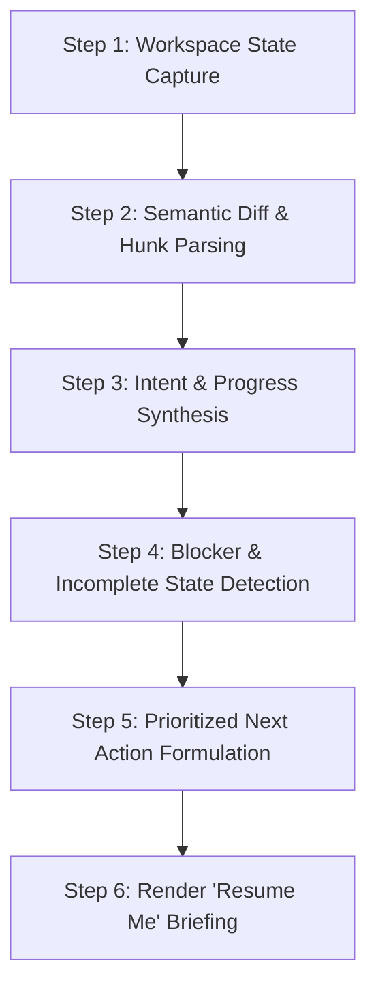

# Context Switch Recovery Assistant

The **Context Switch Recovery Assistant** skill eliminates the high cognitive tax and lost time associated with developer task interruptions and context switching. By examining the current workspace state, active git hunks, open tasks, uncommitted changes, and inline annotations, IBM Bob 2.0 reconstructs exactly where you left off, what was accomplished, what remains half-finished, and what action to take next.

## When to Use This Skill

Activate this skill when:
- A developer returns to a task after a meeting, interruption, or weekend: *"What was I working on?"* or *"Catch me up on where I left off."*
- Switching back to a feature branch after fixing an urgent production hotfix.
- Reviewing uncommitted local changes before deciding whether to commit, stash, or continue.
- Handing off an incomplete task to a pair programmer or teammate.

---

## Step-by-Step Context Recovery Workflow

### Step 1: Workspace State Capture

1. **Check Git Status & Branch Identity**:
   - Determine current branch: `git branch --show-current`
   - Inspect status: `git status --short`
   - Check stashes: `git stash list`
   - Check recent commit history: `git log -n 5 --oneline`
2. **Identify Touched Files**:
   - Catalog modified, staged, untracked, and deleted files.
   - Note recent modification timestamps to identify the most recent active file.

### Step 2: Semantic Diff & Hunk Analysis

1. **Inspect Working Tree Changes**:
   - Run `git diff` (unstaged) and `git diff --cached` (staged).
2. **Detect Structural Modifications**:
   - What functions were added, edited, or deleted?
   - What imports or package dependencies were added or removed?
   - Were new test cases added, or are tests currently modified?

### Step 3: Intent & Incomplete State Detection

1. **Extract Inline Intent Annotations**:
   - Search working tree diffs for keywords: `TODO`, `FIXME`, `WIP`, `TEMP`, `HACK`, `DEBUG`, `console.log`.
2. **Identify Incomplete Constructs**:
   - Stubs, empty function bodies, or commented-out blocks.
   - Syntax errors or incomplete imports.
   - Test files with `.skip`, `.only`, or missing assertion bodies.

### Step 4: Validate Current Build & Test Health

1. **Check Test Status (Non-Destructive)**:
   - Identify tests corresponding to the modified files.
   - Determine if the project is currently in a green (passing) or red (failing/compilation error) state.
2. **Identify Immediate Blockers**:
   - Missing environment variables, broken types, or pending database migrations.

### Step 5: Prioritized Next Action Formulation

Formulate a concise 3-to-5 step checklist ordered by immediate logical sequence:
1. **Immediate fix / completion**: Complete the unfinished function/type definition.
2. **Validation**: Run the specific test file or command that tests the active hunk.
3. **Clean-up**: Remove debug logs, fix any temporary mock data.
4. **Commit milestone**: Stash or commit the working unit.

### Step 6: Render the "Resume Me" Briefing

Generate the briefing using the [Resume Briefing Template](./references/resume_briefing_template.md).

The briefing must deliver:
1. **At-a-Glance Status**: Branch name, elapsed time since last edit, overall task goal.
2. **Accomplished So Far**: Bullet points of finished parts.
3. **In-Progress Work (The "Hanging Thread")**: What file/line was actively being edited when work stopped.
4. **Immediate Next 3 Actions**: Exact, concrete steps and commands to resume instantly.
5. **Key Working Files**: Clickable links to primary files with line ranges.
