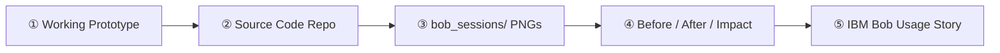

# IBM Bob 2.0 Hackathon Workflow & Submission Guide

The **IBM Bob 2.0 Hackathon Guide** skill provides instructions, checklists, and compliance standards for building and submitting an award-winning project for the IBM Bob 2.0 Hackathon.

## Core Hackathon Objective

> **Prompt**: Build a working prototype that uses IBM Bob 2.0 to significantly improve a specific software-development workflow — such as onboarding, debugging, code review, testing, maintenance, or deployment — and demonstrate measurable productivity/efficiency improvements.
> 
> **Submission Deadline**: 11:00 PM Malaysia time on September 27 (September 27 at 15:00 UTC).

---

## 5 Mandatory Submission Requirements



### Requirement 1: Working Prototype
- Must be a functional solution addressing a specific developer problem.
- Should tangibly improve a chosen developer workflow (e.g., Change Blast Radius Analysis, Code Archeology / Decision Detective, Context Switch Recovery).

### Requirement 2: Source Code Repository
- Clean repository structure with clear README, setup instructions, and architecture diagrams.

### Requirement 3: `bob_sessions/` Consumption Screenshots
You **must** capture Bob task-session summary screenshots directly from the IBM Bob IDE:

```text
Bob IDE
   ↓
Tasks
   ↓
Select relevant task
   ↓
Open task
   ↓
Click task header
   ↓
Task session consumption summary
   ↓
Screenshot
   ↓
Save PNG
   ↓
bob_sessions/
```

- Save each screenshot as a PNG file inside the [`bob_sessions/`](file:///bob_sessions/) directory (e.g., `bob_sessions/task_01_blast_radius.png`, `bob_sessions/task_02_detective.png`).

### Requirement 4: Evidence of Problem + Improvement

Document all 3 dimensions explicitly:

1. **Before**: What was difficult, time-consuming, or error-prone?
2. **After**: How does your solution improve it?
3. **Impact**: How much time, manual effort, errors, or rework does it reduce?

### Requirement 5: Explain Your Use of IBM Bob

The narrative must clearly demonstrate the 6-stage value chain:

```text
Problem
   ↓
Existing workflow
   ↓
Our solution
   ↓
Where IBM Bob is used
   ↓
How Bob improves the workflow
   ↓
Result/impact
```

---

## Dataset & Compliance Guardrails

| Permitted | Prohibited |
| :--- | :--- |
| Public open-source repositories with permissive licenses | Company confidential data |
| Synthetic/mock test datasets | Client proprietary data |
| Public APIs whose terms explicitly permit the use | Personal Identifiable Information (PII) |
| Documented list of public reference datasets | Social media scraping / non-compliant data |
| Sample codebases created for benchmarking | Data/assets without explicit usage rights |

---

## Step-by-Step Hackathon Roadmap

1. **Problem Selection**: Choose one of the core developer workflows (Blast Radius Analyzer, Code Decision Detective, or Context Switch Recovery).
2. **Workflow Definition**: Map the existing manual bottleneck vs the Bob-accelerated workflow.
3. **Prototype Implementation**: Build the functional solution using IBM Bob 2.0.
4. **Session Capture**: Follow the Bob IDE task session capture guide and save consumption summaries into `bob_sessions/`.
5. **Impact Measurement**: Benchmark developer time saved (e.g., 85% faster context recovery, 90% faster blast radius tracing).
6. **Documentation & Video**: Record demo following the 6-stage narrative; verify with the [Submission Checklist](./references/submission_checklist.md).
