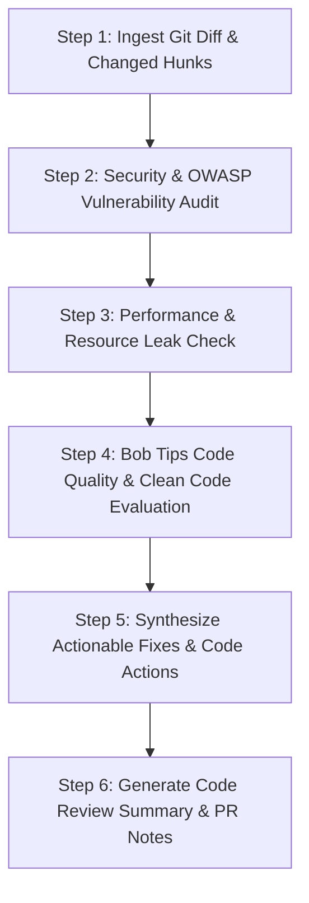

# Intelligent Code Review & Quality Coach

The **Intelligent Code Review & Quality Coach** skill leverages IBM Bob 2.0's code review workflow, **Bob tips** real-time refactoring hints, and security guidelines to provide actionable, senior-level code reviews directly within the IDE or CI/CD pipelines.

## When to Use This Skill

Activate this skill when:
- Preparing a pull request or reviewing teammate changes: *"Review this branch/diff for security, performance, and style."*
- Reviewing high-complexity functions flagged by **Bob tips**.
- Generating clear, conventional PR descriptions and commit messages.
- Verifying code against security standards (OWASP Top 10, ASVS) before pushing.

---

## IBM Bob IDE Feature Alignment

- **Preferred Mode**: **Code Review Mode** (built-in Review tab) & **Plan Mode**
- **Bob Features**:
  - **Bob tips**: Integrates real-time code smell and complexity detection.
  - **Code actions**: Auto-suggests quick fixes and refactorings via IDE lightbulb.
  - **Commit messages & PR generator**: Produces standardized conventional commits and PR descriptions.
- **watsonx Integration**:
  - *watsonx.ai*: Uses IBM Granite models to prioritize critical security findings vs cosmetic nits.
  - *watsonx Orchestrate*: Automatically posts review comments to GitHub/GitLab and updates PR status.

---

## Step-by-Step Code Review Workflow

### Step 1: Ingest Changes & Map Intent
- Run `git diff origin/main...HEAD` or inspect staged files.
- Understand the core objective of the PR before evaluating individual lines.

### Step 2: Security & Vulnerability Audit
- Check for SQL injection, command injection, XSS, unvalidated redirects.
- Ensure authentication/authorization decorators or middleware are not bypassed.
- Verify secrets or tokens are not hardcoded.

### Step 3: Performance & Concurrency Review
- Check for N+1 database queries, unindexed filters, or missing query limits.
- Detect memory leaks, unclosed streams, missing error handlers in async promises.
- Validate thread safety or race condition hazards.

### Step 4: Bob Tips & Code Quality Coaching
- Identify cyclomatic complexity spikes, deeply nested conditionals, and duplication.
- Suggest idiomatic refactoring patterns and clean code conventions.

### Step 5: Prioritized Findings (Blocker vs Nit)
- **🔴 Blocker (Must Fix)**: Bugs, security vulnerabilities, breaking contract changes.
- **🟡 Warning (Should Fix)**: Performance degradation, missing test cases, high complexity.
- **🟢 Suggestion (Nit/Optional)**: Style improvements, naming clarity.

### Step 6: Generate Review Summary
- Output following the [Code Review Summary Template](./references/review_summary_template.md).
