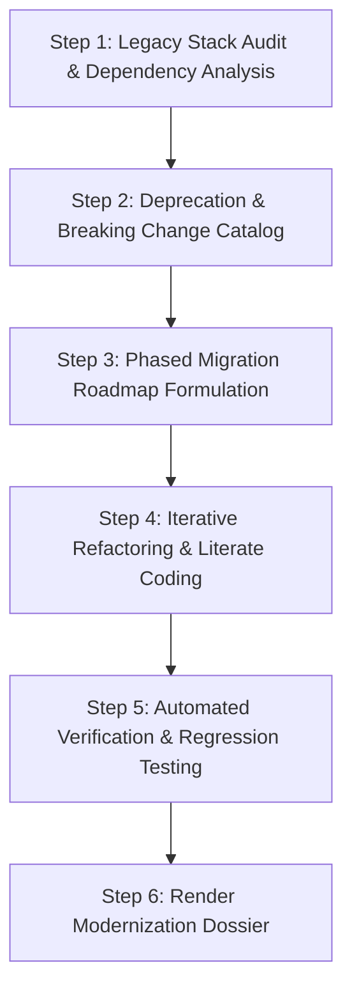

# Legacy Application Modernization Accelerator

The **Legacy Application Modernization Accelerator** guides teams through phased, low-risk upgrades of legacy services, monolithic architectures, and deprecated runtimes using IBM Bob 2.0.

## When to Use This Skill

Activate this skill when:
- Upgrading runtime versions (e.g., Node.js 16 to 22, Java 8/11 to 17/21, Python 3.8 to 3.12).
- Migrating from deprecated libraries (e.g., Express $\rightarrow$ Fastify, CommonJS $\rightarrow$ ESM, Webpack $\rightarrow$ Vite).
- Decomposing monolith modules into decoupled services or microservices.
- Removing technical debt and replacing deprecated APIs with modern patterns.

---

## IBM Bob IDE Feature Alignment

- **Preferred Mode**: **Plan Mode** (for roadmap & dependency matrix) $\rightarrow$ **Code Mode** (for iterative refactoring)
- **Bob Features**:
  - **Literate Coding**: Annotate legacy blocks with modern equivalents and let Bob generate inline replacements.
  - **Auto-approving actions**: Speed up bulk refactoring while relying on tests for safety.
  - **Rollback**: Safely revert unexpected breaking refactorings with single-click restore.
- **watsonx Integration**:
  - *watsonx.ai*: Performs semantic impact analysis across legacy code patterns with Granite models.
  - *watsonx Orchestrate*: Coordinates phased migration milestones, tracking team velocity and CI validation.

---

## Step-by-Step Modernization Workflow

### Step 1: Legacy Stack Audit
- Identify runtime end-of-life dates, unmaintained dependencies, and outdated build scripts.
- Catalog all imports, CommonJS `require()` calls, or deprecated core modules.

### Step 2: Breaking Change & Incompatibility Matrix
- Map breaking changes between target runtime versions (e.g., Node 16 $\rightarrow$ Node 22 changes in crypto, URL parsing, buffer APIs).
- Highlight packages with known incompatibility or missing native bindings.

### Step 3: Phased Migration Roadmap
- Formulate an incremental, non-destructive migration plan:
  1. Phase 1: Bump compatible dependencies.
  2. Phase 2: Convert modules to modern idioms (e.g., async/await, ES modules, modern types).
  3. Phase 3: Upgrade runtime engine and container base images.
  4. Phase 4: Run integration test suites and benchmarks.

### Step 4: Iterative Refactoring & Literate Coding
- Modernize code file by file using Bob's literate coding and code actions.
- Maintain test coverage across each milestone.

### Step 5: Verification & Performance Benchmark
- Execute automated unit and integration tests.
- Compare memory footprint and latency before vs after modernization.

### Step 6: Render Modernization Dossier
- Format using the [Modernization Roadmap Template](./references/modernization_roadmap_template.md).
