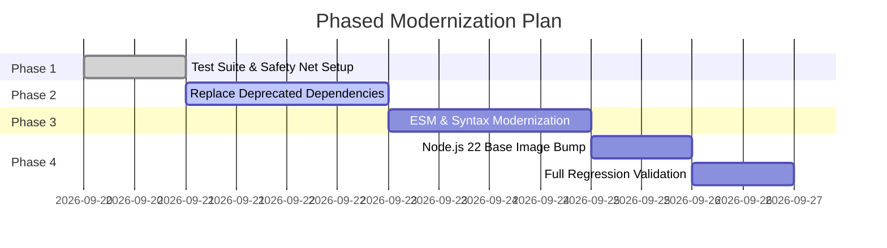

# Legacy Application Modernization Roadmap

## 1. Modernization Objective

| Parameter | Details |
| :--- | :--- |
| **Project / Service** | `billing-api` |
| **Current Baseline** | Node.js 16 (EOL), CommonJS, Express 4.17 |
| **Target Architecture** | Node.js 22 LTS, ES Modules, TypeScript 5.4 |
| **Modernization Strategy** | In-place incremental refactoring with test safety net |
| **Overall Risk** | Medium (Mitigated by 92% test coverage) |

---

## 2. Incompatibility & Deprecation Matrix

| Dependency / API | Legacy State | Modern Replacement | Action Required |
| :--- | :--- | :--- | :--- |
| `request` | Deprecated (v2.88) | Native `fetch` / `undici` | Replace all HTTP calls with native `fetch` |
| `new Buffer()` | Deprecated in Node 16+ | `Buffer.from()` / `Buffer.alloc()` | Safe automated refactor |
| `bodyParser` middleware | Standalone package | Express built-in `express.json()` | Simplify dependency tree |
| Module syntax | CommonJS (`require`) | ES Modules (`import/export`) | Update `tsconfig.json` & `package.json` |

---

## 3. Phased Execution Plan



---

## 4. Verification & Health Check

```bash
# Verify unit and integration tests under new Node runtime
node -v # Ensure v22.x
npm test

# Run build / bundle verification
npm run build
```
