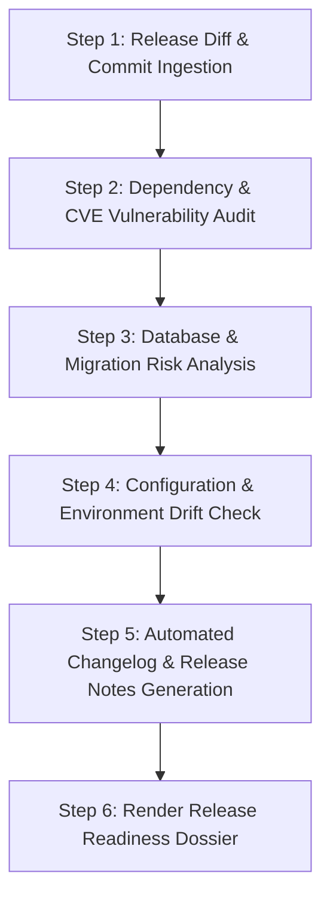

# Release Readiness & Deployment Assistant

The **Release Readiness & Deployment Assistant** prepares engineering teams to release software with confidence. By inspecting commit ranges, dependency bumps, migration files, and configuration shifts, IBM Bob 2.0 ensures that releases are predictable and risk-free.

## When to Use This Skill

Activate this skill when:
- Preparing a production release or staging deployment: *"Are we ready to cut release v2.4.0?"*
- Generating comprehensive, customer-facing or internal release notes and changelogs.
- Auditing dependency vulnerability advisories (CVEs) prior to shipping.
- Verifying deployment prerequisites (DB migrations, environment variables, secret rotations).

---

## IBM Bob IDE Feature Alignment

- **Preferred Mode**: **Plan Mode** (for deployment risk evaluation) & **Agent Mode** (for changelog generation)
- **Bob Features**:
  - **Commit messages & PRs**: Collates commit messages and PR metadata across the release branch.
  - **Document understanding**: Reads Dockerfiles, Helm charts, Kubernetes manifests, and Terraform files.
  - **Subagents**: Spawns subagents to simultaneously audit security advisories and migration scripts.
- **watsonx Integration**:
  - *watsonx Orchestrate*: Automates multi-stage release pipelines, triggering staging deployments and notifying stakeholders in Slack/Teams.
  - *watsonx.ai*: Uses Granite models to draft high-level executive summaries and stakeholder impact briefs.

---

## Step-by-Step Release Readiness Workflow

### Step 1: Ingest Release Commit Range
- Run `git log <last-release-tag>...HEAD --oneline` to catalog all changes.
- Categorize commits by type (`feat`, `fix`, `perf`, `refactor`, `chore`, `docs`).

### Step 2: Audit Third-Party Dependencies
- Check package lockfiles (`package-lock.json`, `poetry.lock`, `go.sum`).
- Flag upgraded dependencies and any known vulnerabilities or license incompatibilities.

### Step 3: Database Migration & Schema Alterations
- Inspect new files in `migrations/` or `prisma/migrations`.
- Flag non-backward-compatible operations (e.g., column drop, table rename, index locks).

### Step 4: Configuration & Environment Drift Check
- Compare `.env.example` across the release to identify newly required secrets or environment flags.
- Check infrastructure-as-code manifests for replica counts or resource limit adjustments.

### Step 5: Generate Categorized Release Notes
- Synthesize user-facing improvements, developer improvements, bug fixes, and deprecations.

### Step 6: Render Release Readiness Dossier
- Format using the [Release Readiness Dossier Template](./references/release_dossier_template.md).
