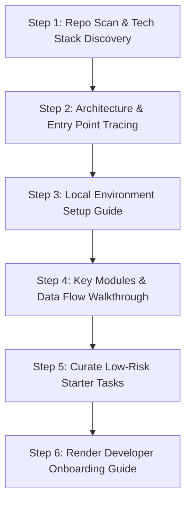

# Smart Developer Onboarding Assistant

The **Smart Developer Onboarding Assistant** accelerates new developer ramp-up time from weeks to hours by using IBM Bob 2.0's document understanding, context mentions, and repository analysis capabilities.

## When to Use This Skill

Activate this skill when:
- A new engineer joins the project and asks: *"Where do I start?"* or *"Explain how this system works."*
- Bootstrapping a local development environment, Docker containers, or environment configurations.
- Looking for low-risk, high-impact "good first issues" or starter tasks to make an initial contribution.
- Understanding the architectural relationships between frontend, backend, databases, and third-party integrations.

---

## IBM Bob IDE Feature Alignment

- **Preferred Mode**: **Ask Mode** (for architectural Q&A) $\rightarrow$ **Plan Mode** (for structuring setup steps)
- **Context Mentions**: Use `@folder` (e.g., `@src`, `@config`) and `@file` (e.g., `@package.json`, `@docker-compose.yml`)
- **Bobcoin Optimization**: Avoid reading massive asset folders; use `.bobignore` to keep repository scans under 2 Bobcoins.
- **watsonx Integration**:
  - *watsonx.ai*: Conversational tutor answering onboarding questions using IBM Granite models.
  - *watsonx Orchestrate*: Automated checklist assigning onboarding tickets and environment credentials.

---

## Step-by-Step Onboarding Workflow

### Step 1: Scan Tech Stack & Project Anatomy
- Inspect root package files (`package.json`, `pom.xml`, `requirements.txt`, `go.mod`, `Cargo.toml`).
- Identify language runtime versions, frameworks, build systems, and test runners.

### Step 2: Architecture & Entry Point Tracing
- Locate application entry points (`index.ts`, `server.js`, `main.py`, `App.tsx`).
- Trace core middleware, router definitions, and database connection pools.
- Generate a Mermaid architecture diagram of the high-level components.

### Step 3: Local Environment Bootstrap Guide
- Identify required environment variables from `.env.example`.
- Extract prerequisite tools (Docker, Node, Python, Redis, Postgres).
- Provide verifiable terminal commands to install dependencies, run seed migrations, and start local servers.

### Step 4: Core Data Flows & Domain Models
- Map the primary user journeys (e.g., User Login $\rightarrow$ Token Minting $\rightarrow$ Cart Operations $\rightarrow$ Checkout).
- Document key entities and where business logic lives versus transport controllers.

### Step 5: Curate "Good First Issues" (Starter Tasks)
- Identify low-risk starter tasks:
  1. Adding a missing unit test for a utility function.
  2. Improving API validation on a specific endpoint.
  3. Updating documentation or adding missing type definitions.

### Step 6: Generate the Onboarding Guide
- Format the output following the [Developer Onboarding Guide Template](./references/onboarding_guide_template.md).
