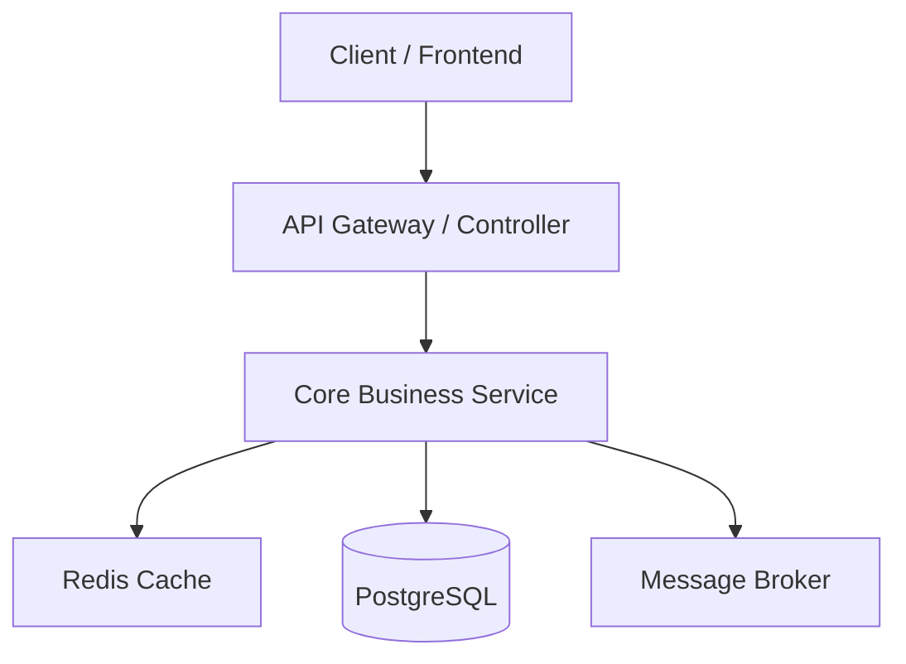

# Developer Onboarding Guide

## 1. System Overview

| Parameter | Details |
| :--- | :--- |
| **System Name** | `<System Name>` |
| **Primary Languages** | TypeScript / Python / Go / Java |
| **Frameworks** | Express / Next.js / FastAPI / Spring Boot |
| **Databases & Queues** | PostgreSQL, Redis, RabbitMQ |
| **CI/CD & Deployment** | GitHub Actions, Docker, Kubernetes |

---

## 2. High-Level Architecture



---

## 3. Fast-Track Local Setup

Run the following commands to bootstrap the development environment:

```bash
# 1. Install dependencies
npm install

# 2. Configure environment
cp .env.example .env

# 3. Start local backing services
docker compose up -d postgres redis

# 4. Run database migrations
npm run db:migrate

# 5. Start development server
npm run dev
```

---

## 4. Key Code Paths & Entry Points

- **API Routes**: `[src/routes/](file:///src/routes/)`
- **Business Services**: `[src/services/](file:///src/services/)`
- **Database Entities**: `[src/models/](file:///src/models/)`
- **Test Suites**: `[tests/](file:///tests/)`

---

## 5. Curated Starter Tasks ("Good First PRs")

- [ ] **Task 1: Add Unit Tests**: Expand test coverage for `[src/utils/formatter.ts](file:///src/utils/formatter.ts)`.
- [ ] **Task 2: Validate Request Schemas**: Add Zod/Joi validation for user profile update endpoint.
- [ ] **Task 3: Refactor Query Helper**: Extract repetitive pagination logic into a reusable middleware.
