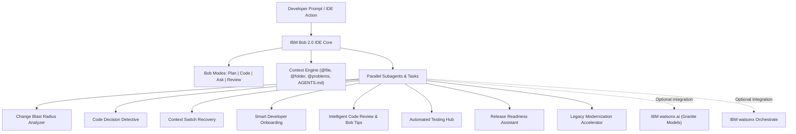
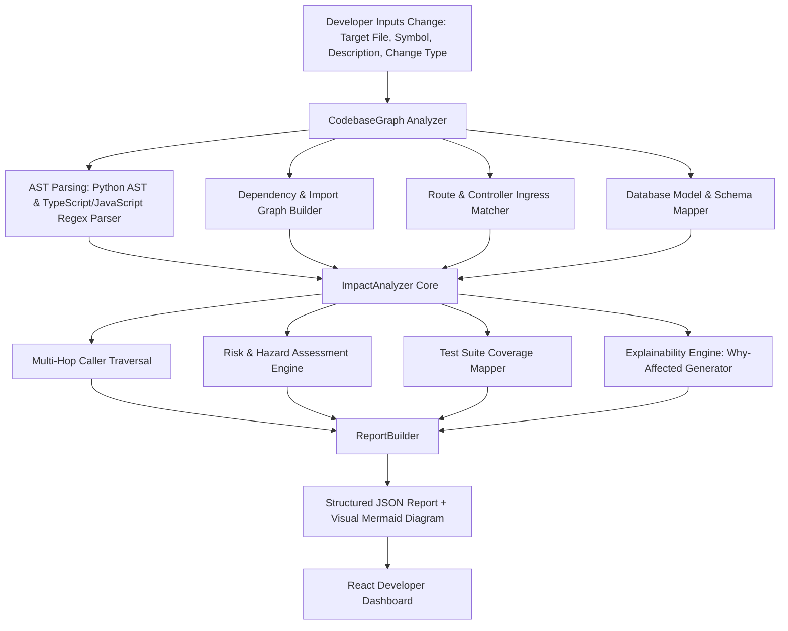

# IBM Bob 2.0 — Developer Workflow Acceleration Suite

> **IBM Bob 2.0 Hackathon Submission**  
> **Theme**: *Build with purpose using IBM Bob 2.0*  
> **Submission Deadline**: September 27 at 11:00 PM Malaysia Time (15:00 UTC)  
> **Target Instance**: `ibm-coding-challenge-uat` (Region: `us-east`)

---

## 📌 Executive Summary

Modern software engineering is burdened by heavy cognitive friction: **dependency blindspots**, **undocumented legacy decisions**, **frequent context switching**, and **arduous manual reviews**. Developers spend under 30% of their workday writing logic — the remainder is lost to manual dependency tracing, code archaeology, and task re-orientation.

This repository delivers an **Agentic Developer Workflow Acceleration Suite** engineered natively for **IBM Bob IDE 2.0**. Leveraging Bob's core capabilities — **Agent Mode**, **Subagents**, **Parallel Tasks**, **Context Mentions (@-mentions)**, **Modes (Plan/Code/Ask)**, and **Document Understanding** — this suite turns IBM Bob into an autonomous pair-programmer and workflow multiplier.

---

## 🏗️ Architecture & IBM Bob 2.0 Capabilities



### Key Bob Features Utilized
- **Agent Mode & Subagents**: Handles focused, multi-file tasks concurrently in isolated contexts without polluting the main conversation.
- **Persistent Context (`AGENTS.md`)**: Ingested automatically by Bob across conversations and modes to enforce architectural boundaries and style rules.
- **Context Mentions (`@file`, `@folder`, `@problems`)**: Precisely references project elements to maximize accuracy while minimizing context token overhead.
- **Modes Workflow**: Employs **Plan Mode** for architectural mapping before delegating to **Code Mode** for execution.
- **Literate Coding & Code Actions**: Writes natural language instructions directly in editor lines with instant inline diff previews.
- **Bob Tips**: Real-time detection of cyclomatic complexity, code smells, and technical debt with lightbulb refactorings.
- **Rollback System**: Automatic versioning allows safe experimentation with instantaneous rollback capabilities.
- **Optimization via `.bobignore`**: Eliminates unnecessary file indexing to conserve the 40 Bobcoins quota.

---

## 🎯 1. The Problem

Modern software development moves at high velocity, yet engineering teams operate with significant blind spots. When developers are asked to modify a core service, update a database model, or adjust a function signature, they face critical unknowns:
- **Hidden Upstream Callers**: Modifying a utility function or service method often breaks distant controllers or background workers.
- **Contract Drift & Ingress Hazards**: Changes in internal response models cascade to REST/GraphQL APIs and frontend clients without early warning.
- **Database Schema Cascades**: Renaming or mutating a database column risks breaking un-migrated queries and ORM serialization pipelines.
- **Test Blindspots**: Engineers struggle to determine which specific unit, integration, or end-to-end test suites cover the modified codepaths.

---

## 🧩 2. Why Change Impact Analysis Is Difficult

1. **Polyglot & Multi-Tier Codebases**: Modern systems span frontend SPAs (React/TypeScript), backend services (Python/Flask/FastAPI), and relational persistence schemas. Tracing dependencies across language boundaries manually is error-prone.
2. **Exponential Transitive Cascades**: A 1-line change to `PaymentService` cascades to `handle_checkout`, which routes through `OrderController`, `OrderPage.tsx`, and associated integration test files.
3. **Manual Grepping is Unreliable**: `grep` and text searches generate false positives in comments and documentation while missing aliased imports or indirect invocations.
4. **Cognitive Fatigue & Time Sinks**: Manually tracing call graphs takes 45–60 minutes per non-trivial PR, slowing down velocity and causing release anxiety.

---

## 💡 3. Our Solution: Change Blast Radius Analyzer

The **Change Blast Radius Analyzer** is an intelligent, developer-centric workflow tool that automatically scans code changes and computes an exact **Blast Radius Impact Report** in milliseconds.

Key highlights:
- **Multi-Hop Dependency Traversal**: Traces direct and transitive callers across service, model, controller, route, and UI layers.
- **Explainable Impact ("Why affected")**: Generates contextual rationales for every affected component.
- **Live Visual Blast Radius Graph**: Renders interactive Mermaid dependency trees.
- **Risk Scoring & Breaking Hazard Detection**: Categorizes blast risk (`CRITICAL`, `HIGH`, `MEDIUM`, `LOW`) based on API boundaries and database persistence.
- **Prescriptive Validation Plan**: Generates exact CLI commands (`pytest`, `npm test`) and migration checklists needed before merging.

---

## ⚙️ 4. How the Analyzer Works



1. **Codebase Indexing**: Parses Python ASTs and TypeScript component trees into a directed symbol dependency graph.
2. **Target Resolution**: Maps developer inputs to specific class methods, functions, or UI components.
3. **Multi-Hop Graph Traversal**: Recursively traverses upstream callers, API ingress routes, and database models.
4. **Risk & Hazard Heuristics**: Evaluates signature changes, schema modifications, and public API exposures.
5. **Report & Visual Synthesis**: Compiles structured metrics and Mermaid graph syntax returned via REST API.

---

## 🏛️ 5. System Architecture

The project is structured into three clean layers:

```text
IBM-Bob-2.0/
├── backend/                             # Python / Flask Analysis Engine
│   ├── app.py                           # REST API Server (Endpoints: /api/tree, /api/symbols, /api/analyze)
│   ├── engine/                          # Core Graph & Analysis Algorithms
│   │   ├── codebase_graph.py            # AST & multi-language dependency graph indexer
│   │   ├── impact_analyzer.py           # Blast radius, hazard detection & test matcher
│   │   ├── target_resolver.py           # AST & regex symbol locator
│   │   ├── report_builder.py            # Report formatting & Mermaid diagram generator
│   │   └── models.py                    # Structured dataclasses
│   └── tests/                           # 183 automated unit, integration & scenario tests
│       ├── test_scenarios.py            # 5 end-to-end hackathon scenarios
│       ├── test_impact_analyzer.py      # Core impact algorithm validation
│       ├── test_api_endpoints.py        # Flask REST API testing
│       └── test_codebase_analyzer.py    # AST & graph parser unit tests
├── frontend/                            # React 18 + TypeScript + Vite Developer Dashboard
│   ├── src/
│   │   ├── App.tsx                      # Main workbench & state manager
│   │   ├── api.ts                       # Typed REST client
│   │   ├── types.ts                     # Full TypeScript schema definitions
│   │   └── components/
│   │       ├── FileTree.tsx             # Interactive project file explorer
│   │       ├── AnalyzeForm.tsx          # Change input & 5 demo scenario quick-starts
│   │       ├── ImpactReport.tsx         # Comprehensive impact dashboard & risk cards
│   │       └── MermaidDiagram.tsx       # Interactive visual graph renderer
└── .agents/skills/                      # IBM Bob 2.0 Skill definitions
    └── change-blast-radius-analyzer/    # Native Bob skill instructions & context
```

---

## 🛠️ 6. Technology Stack

- **Backend**: Python 3.11, Flask, Flask-CORS, Python standard `ast`, Pytest (183 tests).
- **Frontend**: React 18, TypeScript, Vite, TailwindCSS, Mermaid.js (SVG graph visualization).
- **Tooling & IDE**: IBM Bob 2.0 (Plan Mode, Code Mode, Agent Mode, Subagents, Context Mentions).

---

## 🤖 7. How IBM Bob 2.0 Was Used

IBM Bob 2.0 served as the primary agentic engine throughout development:
- **Modes Workflow**: Used **Plan Mode** for architectural mapping of graph traversal algorithms before executing code edits in **Code Mode**.
- **Agent Mode & Subagents**: Spawned isolated subagents to independently build and test the 5 hackathon scenario test suites without polluting global context.
- **Context Mentions (`@file`, `@folder`)**: Used targeted context pointers (`@services/payment_service.py`, `@backend/engine/`) to keep prompt iterations fast and conserve the 40 Bobcoins quota.
- **Local AST Strategy**: Designed the engine to perform graph calculations locally (<20ms), reserving Bob reasoning for complex architectural synthesis.

---

## ⚡ 8. How to Run the Project

### Prerequisites
- Python 3.10+
- Node.js 18+ and npm

### 1. Launch the Backend Engine
```bash
# In repository root:
python -m pip install flask flask-cors pytest
python backend/app.py
# -> Backend active on http://127.0.0.1:5000
```

### 2. Launch the Frontend UI
```bash
cd frontend
npm install
npm run dev
# -> Frontend active on http://127.0.0.1:5173/
```

### 3. Run the Automated Test Suite
```bash
python -m pytest backend/tests/ -v
# -> 183 passed in 0.6s
```

---

## 🎮 9. Example Usage & 3-Minute Demo

1. Open `http://127.0.0.1:5173/` in your browser.
2. Select any of the **5 Demo Quick-Start Scenarios**:
   - **💳 1. PaymentService (Stripe provider)**: Adding Stripe to `process_payment` triggers `HIGH` risk, surfacing upstream callers (`PaymentController`, `OrderService`), API routes (`/api/v1/payments`), and database sinks (`Payment`).
   - **🧾 2. OrderService (Status handling)**: Modifying order state machine in `confirm_order` tracks dependencies through `OrderPage.tsx` and order APIs.
   - **👤 3. UserService (Add phone number)**: Schema change in `register_user` highlights authentication ingress and database hazards.
   - **🗄️ 4. Payment Model (Schema update)**: Database column additions cascade upward to service methods and controllers.
   - **🛒 5. Checkout UI (Frontend flow)**: UI state refactoring highlights child components and backend checkout APIs.
3. Click **🔍 Analyze Blast Radius** to inspect:
   - Risk rating banner and blast metric counters.
   - Interactive Mermaid dependency graph.
   - Explainable *"Why affected"* cards for all callers.
   - Actionable CLI testing commands.

---

## 🔍 10. Known Technical Limitations

1. **Static AST Analysis Scope**: Relies on static AST syntax trees and regex symbol mapping. Dynamic reflections (e.g. Python `getattr(obj, dynamic_str)`) require explicit symbol references.
2. **Supported Languages**: Out-of-the-box support for Python backend code and TypeScript/JavaScript React frontend files.
3. **Database Introspection**: Model relationships are extracted from ORM classes and DDL code rather than querying a live running database instance.
4. **Bobcoin Optimization**: Local graph computation runs deterministically without burning cloud LLM tokens on simple traversals.

---

## 🔮 11. Future Improvements

1. **Git Diff PR Ingestion**: Add GitHub/GitLab webhook integration to automatically run blast radius analysis on incoming PR diffs.
2. **Polyglot Grammar Extensions**: Add Tree-sitter parsers for Java (Spring Boot), Go (Gin/Fiber), and C#.
3. **Live Database Migration Diffing**: Connect to staging databases to compare active schema catalogs against ORM model definitions.
4. **Automated Test Generation Handoff**: Connect blast radius output directly into IBM Bob's `automated-testing-hub` skill to auto-generate missing test cases for uncovered callers.

---

## 🔒 Dataset & Privacy Compliance

In strict compliance with IBM Bob Hackathon rules:
- **Permitted Data**: All benchmarks and examples use public repositories with permissive open-source licenses, synthetic mock datasets, and documented public sources.
- **Strictly Prohibited**:
  - ❌ Zero company confidential data
  - ❌ Zero client proprietary data
  - ❌ Zero Personal Identifiable Information (PII)
  - ❌ Zero social media data or unpermitted assets

---

## 🌿 Git Branching Strategy

- **`main`**: Production release and official hackathon submission branch.
- **`jish`**: Active development branch.
- **`coreen`**: Collaborative teammate feature branch.
